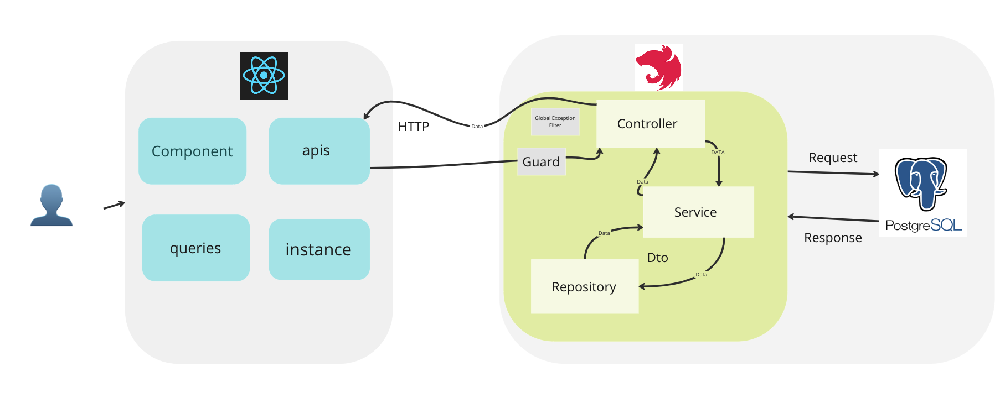
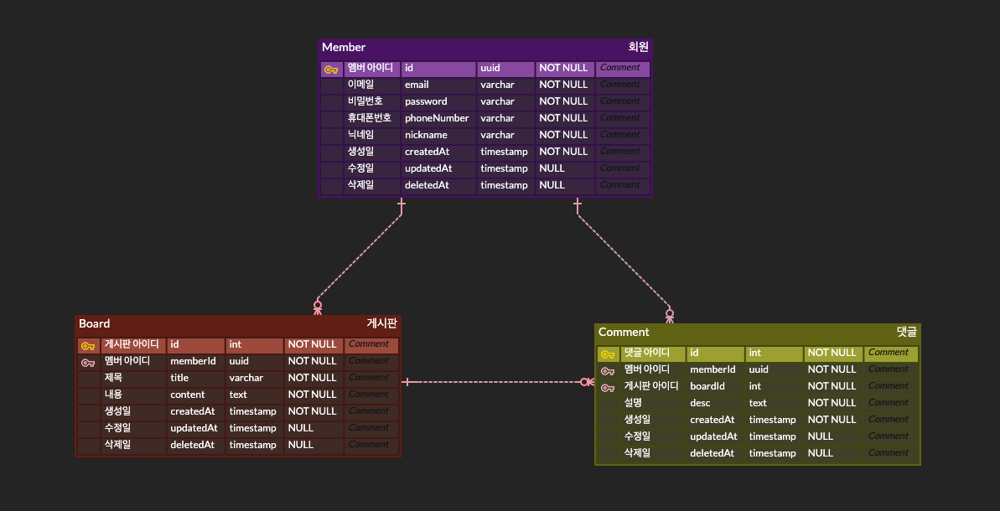

# [백엔드] 토이프로젝트 게시판

## BackEnd - 심재두

### 아키텍쳐 구조



### Board ERD 설계


---

## #프로젝트 소개
- 가드를 통해 비회원은 이용할 수 없고, 회원가입이 된 멤버를 통해서만 게시글 작성이 가능합니다.
- 로그인을 통해 받은 토큰은 쿠키에 담아 멤버 아이디를 전달합니다.
- 회원가입, 나의 정보수정, 로그인, 게시글작성, 댓글 작성이 가능합니다.
- 게시글안에 댓글을 작성 할 수 있으며, 게시글 클릭시 해당하는 게시글에 대한 전체댓글들이 보여집니다.
- 본인이 작성한 글,댓글에만 권한이 있으며, 다른 멤버의 글과 댓글에는 권한이 없습니다. 


### 사용기술
- TypeScript
- NestJs
- Prisma
- PostgreSQL


### Server Use
```bash
npm run start:dev
```

### Install
```angular2html
npm i | npm install
```